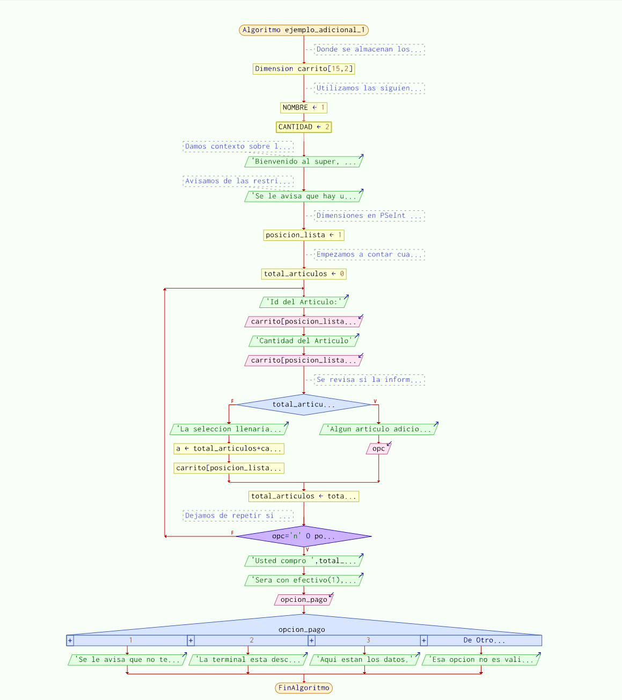

# [Ejemplo Adicional - Usando estructuras de control para una tienda ](https://www.youtube.com/watch?v=ITfnJW831z8&list=PLx4vAEcrpWyGMKg4tGCZi1QtLeexLZOJy&index=7)
```
Algoritmo ejemplo_adicional_1
    //Donde se almacenan los articulos a comprar
    Dimension carrito[15,2]
    //Utilizamos las siguientes variables para ayudar con la legibilidad mas adelante
    NOMBRE<-1
    CANTIDAD<-2
    
    Escribir 'Bienvenido al super, que va a comprar?' //Damos contexto sobre lo que hace el programa
    Escribir 'Se le avisa que hay un maximo de 15 articulos por compra.'//Avisamos de las restriciones puestas
    //Dimensiones en PSeInt empiezan en 1 (Esto se puede cambiar en configurar > opciones del Lenguaje (perfiles) > personalizar)
    posicion_lista<-1
    //Empezamos a contar cuantos articulos llevan
    total_articulos<-0
    Repetir
   	 Escribir 'Id del Articulo:'
   	 Leer carrito[posicion_lista,NOMBRE]
   	 Escribir 'Cantidad del Articulo'
   	 Leer carrito[posicion_lista,CANTIDAD]
   	 //Se revisa si la informacion añadida rompe la restriccion dada de un maximo de 15 articulos
   	 si total_articulos + carrito[posicion_lista,CANTIDAD] < 15 Entonces
   		 Escribir 'Algun articulo adicional?'
   		 Leer opc
   	 sino
   		 Escribir 'La seleccion llenaria el carrito, o lo llenara de mas. Se agregara la cantidad suficiente para llegar al limite.'
   		 a<-total_articulos + carrito[posicion_lista,CANTIDAD] - 15
   		 carrito[posicion_lista,CANTIDAD] <- carrito[posicion_lista,CANTIDAD] - a
   	 FinSi
   	 total_articulos<-total_articulos+carrito[posicion_lista,CANTIDAD]
    Hasta Que opc = 'n' o posicion_lista >= 15 o total_articulos >= 15 //Dejamos de repetir si el usuario lo pide o llegamos al limite de 15 articulos
    Escribir 'Usted compro ' total_articulos ' articulos en total.'
Escribir 'Sera con efectivo(1), tarjeta(2), o por transferencia?(3)?'
    Leer opcion_pago
    Segun opcion_pago Hacer
   	 1:
   		 Escribir 'Se le avisa que no tenemos cambio al momento.'
   	 2:
   		 Escribir 'La terminal esta descompuesta, lo sentimos.'
   	 3:
   		 Escribir 'Aqui estan los datos.'
   	 De Otro Modo:
   		 Escribir 'Esa opcion no es valida.'
    Fin Segun
FinAlgoritmo
```


Aquí hacemos uso de las estructuras de control que hemos visto en este capítulo.

Todavía hay puntos en lo que se puede mejorar este ejemplo:
- ¿Qué pasa si se mete información fuera de lo esperado?
    - ¿De qué forma se implementa una manera de evitar el ingresar información errónea?
- No existe la funcionalidad de editar o eliminar artículos del carrito, ¿cómo lo implementaría usted?
- En el carrito, los artículos son almacenados con un número de identificación en vez de su nombre, ¿cómo se podrían utilizar los nombres de los artículos en este programa?

Existen otras maneras de mejorar este programa, piensa en una.
