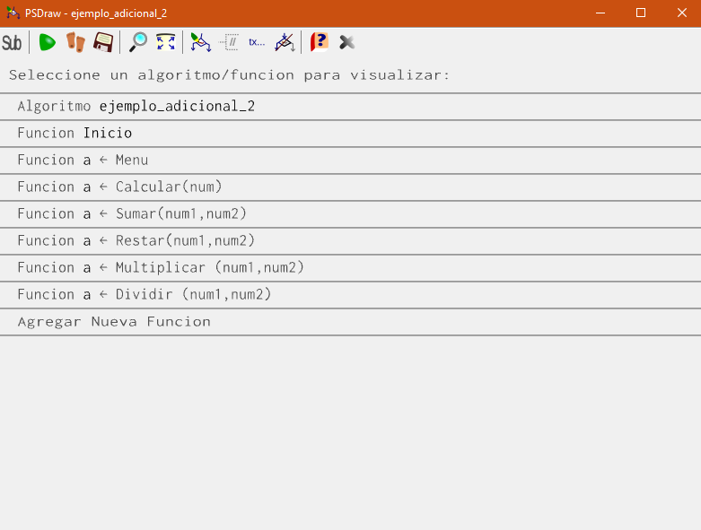
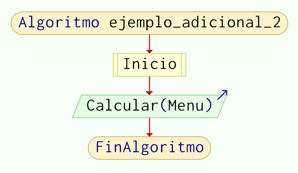
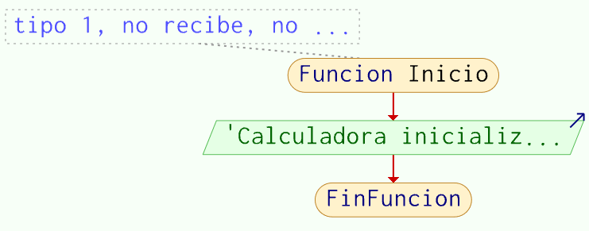
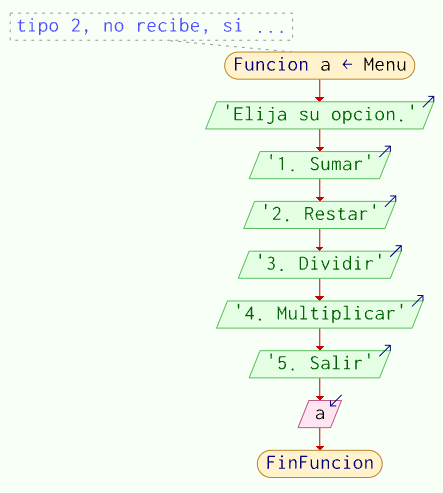
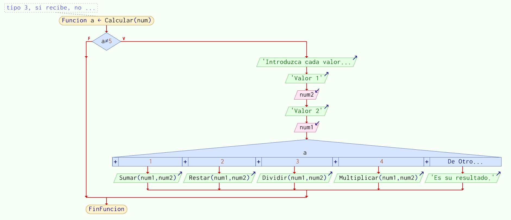
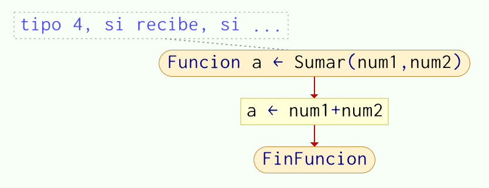

# [Ejemplo Adicional - Usando los tipos de funciones en una calculadora](https://www.youtube.com/watch?v=wqGUubU90AE&list=PLx4vAEcrpWyGMKg4tGCZi1QtLeexLZOJy&index=8)
Para este siguiente ejemplo adicional tenemos una calculadora, que hace uso de los 4 tipos de funciones que vimos.
```
Algoritmo ejemplo_adicional_2
    Inicio
    Calcular(Menu)
FinAlgoritmo

Funcion Inicio //tipo 1, no recibe, no regresa
    Escribir "Calculadora inicializada"
FinFuncion

Funcion a<-Menu //tipo 2, no recibe, si regresa
    Escribir "Elija su opcion."
    Escribir "1. Sumar"
    Escribir "2. Restar"
    Escribir "3. Dividir"
    Escribir "4. Multiplicar"
    Escribir "5. Salir"
    Leer a
FinFuncion

Funcion Calcular(num) //tipo 3, si recibe, no regresa
    Si a != 5 Entonces
   	 Escribir "Introduzca cada valor por separado."
   	 Escribir "Valor 1"
	 Leer num1
   	 Escribir "Valor 2”
   	 Leer num2
   	 Segun a Hacer
   		 1:
   			 Escribir Sumar(num1,num2)
   		 2:
   			 Escribir Restar(num1,num2)
   		 3:
   			 Escribir Dividir(num1,num2)
   		 4:
   			 Escribir Multiplicar(num1,num2)
   		 De Otro Modo:
   			 Escribir "Es su resultado."
   	 Fin Segun
   	 
    FinSi
FinFuncion

Funcion a<-Sumar(num1, num2) //tipo 4, si recibe, si regresa
    a<-num1+num2
FinFuncion

Funcion a<-Restar(num1, num2)
    a<-num1-num2
FinFuncion

Funcion a<-Multiplicar (num1, num2)
    a<-num1*num2
FinFuncion

Funcion a<-Dividir (num1, num2)
    a<-num1/num2
FinFuncion
```
La forma en que implementamos las funciones de Sumar, Restar, Multiplicar y Dividir es similar como el resto de las funciones matemáticas fueron implementadas en PSeInt. Como ejemplo: la fórmula para sen(x), teniendo solo el ángulo:
$\sin(x)=\sum_{k=0}^n \frac{(-1)^k}{(2k=1)!} x^{2k+1}$
Una implementación de este algoritmo está definida como la función de sen(x) en PSeInt.

Cabe mencionar, que el visualizador de grafos de PSeInt pide que se elija cuál algoritmo/función se busca visualizar.






Como con los demás ejemplos, ¿qué mejoras se podrían implementar en este programa?
Una idea es agregar más funciones, no solo implementar la capacidad de utilizar las funciones matemáticas ya implementadas en PSeInt, sino también una función matemática nueva.
