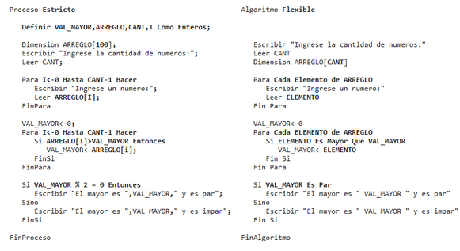

# [Identificar y utilizar la herramienta de PSeInt para la representación de programas.](https://www.youtube.com/watch?v=D-pUPh5NL5A&list=PLx4vAEcrpWyGMKg4tGCZi1QtLeexLZOJy&index=1)

PSeInt es un entorno de desarrollo diseñado como herramienta de aprendizaje para el nuevo programador. PSeInt utiliza tanto pseudocódigo cercano al lenguaje humano, como diagramas de flujo para ayudar a la mente del estudiante a entender el flujo del programa. Con esto, el estudiante poco a poco obtiene la mentalidad requerida para ser programador.

Correr PSeInt es sencillo, está disponible para GNU/Linux, Windows y macOS en forma de instalador o portable. Si es capaz de soportar uno de esos sistemas operativos entonces podrá correr PSeInt.

PSeInt se descarga de la siguiente pagina https://pseint.sourceforge.net/index.php?page=descargas.php
Este material asume que se está instalando con el sistema operativo windows.

“El paquete para Windows es un instalador ejecutable. Abrir y seguir las instrucciones (el mismo instalador funciona en cualquier Windows, ya sea de 32 o 64 bits).
		
Si se utiliza la versión ‘portable’, el ejecutable que se debe lanzar es ‘wxPSeInt.exe’.” (zaskar_84, n.d.)

Entre las características y funcionalidades que tiene PSeInt son:

- Presenta herramientas de edición para escribir algoritmos en pseudocódigo en español.
- Autocompletado.
- Ayudas Emergentes.
- Plantillas de Comandos.
- Coloreado de Sintaxis.
- Resaltado de bloques lógicos.
- Indentado Inteligente.
- Listados de funciones, operadores y variables.
- Permite generar y editar el diagrama de flujo del algoritmo.
- Puede trabajar con diagramas clásicos y de Nassi-Shneiderman.
- Permite la edición simultánea de múltiples algoritmos.
- El pseudo-lenguaje utilizado es configurable.
- Ofrece perfiles de configuración predefinidos para numerosas instituciones.
- Puede interpretar (ejecutar) los algoritmos escritos.
- Puede modificar el algoritmo y ver los cambios en la ejecución inmediatamente (sin reingresar los datos).
- Permite modificar uno o más datos selectos de una ejecución ya finalizada para observar cómo varían los resultados.
- Permite deshacer una ejecución para reiniciarla o repetirla desde un punto arbitrario.
- Permite ejecutar el algoritmo paso a paso controlando la velocidad e inspeccionando variables y expresiones.
- Puede confeccionar automáticamente una tabla de prueba de escritorio.
- Ofrece un modo especial en el que describe las acciones realizadas en cada paso.
- Determina y marca claramente los errores
- Señala errores de sintaxis en tiempo real (mientras escribe).
- Señala claramente errores en el tiempo de ejecución.
- Ofrece descripciones detalladas de cada error, con sus causas y soluciones más frecuentes.
- Permite convertir el algoritmo de pseudocódigo a código de numerosos lenguajes de programación.
- C, C++, C#, Java, JavaScript, MatLab, Pascal, PHP, Python 2, Python 3, QBasic Visual Basic.
- Ofrece un sistema de ayuda integrado acerca del pseudocódigo y el uso del programa.
- Incluye un conjunto de ejemplos de diferentes niveles de dificultad.
- Es multiplataforma (probado en Microsoft Windows, GNU/Linux y Mac OS X).
- Es totalmente libre y gratuito (licencia GPLv2).

[Lista obtenida de aquí](https://pseint.sourceforge.net/index.php?page=features.php) (zaskar_84, n.d.)

Pero, como toda herramienta, hay desventajas y limitaciones, la principal siendo su enfoque. Con esto digo que es una “herramienta para asistir a un estudiante en sus primeros pasos en programación” (zaskar_84, n.d.), 
no una herramienta de producción. Con PSeInt se le puede enseñar a alguien los conceptos básicos de programación, pero ahí es donde termina su utilidad.

Al iniciar el software de PSeInt, como se muestra en la imagen 1, es considerada como pantalla principal. 


Imagen 1. Pantalla principal de PSeInt.

PSeInt tiene 2 maneras de representar un programa:
- PseudoCódigo en texto, una manera similar a lo que se vería en un entorno regular de programación. Esta es la forma por defecto que utiliza PSeInt.  
```
Algoritmo func
	a<-10
	b<-2
	c<-a*b
	Escribir c
FinAlgoritmo
```

En esta modalidad, se tiene funcionalidades comunes que ayudan al desarrollo como auto-competición de funciones y detección de errores antes de ejecución. 
La diferencia que hace PSeInt de otros entornos de desarrollo es que el lenguaje de programación que utiliza está diseñado para ser similar al lenguaje humano para facilitar su entendimiento. 
Pero eso no es todo, [también se tiene opciones para hacer este lenguaje más o menos parecido al lenguaje humano](https://pseint.sourceforge.net/index.php?page=perfiles.php), visible en la Imagen 2. (zaskar_84, n.d.)



Imagen 2. Comparación entre distintas presentaciones del lenguaje.

Diagramas de flujo, que es utilizada en el ámbito profesional, pero menos ubicua en comparación. Se accede por medio de este botón, mostrado en la imagen 3:  
  

Imagen 3. Botón para Acceder al Diagrama de Flujo.

Y muestra el siguiente diagrama en la imagen 4, generado a partir del código anterior  

  

Imagen 4. Ejemplo de Diagrama de Flujo.

El diagrama fluye de arriba hacia abajo, con flechas denotando la dirección que toma el programa, incluyendo si nos regresamos a un punto anterior. 
En esta vista todavía se pueden hacer cambios al programa como agregar, quitar, o editar comandos seleccionandolos de manera directa o con el uso del menú de comandos de la imagen 5.  
  

Imagen 5. Lista de Comandos de la Vista de Diagrama de Flujo.

Uno similar existe en la forma de código en texto, presente en la imagen 6.  

  

Imagen 6. Lista de Comandos en la Vista en Texto.

Cada uno hace lo siguiente:
- “Escribir” imprime un mensaje en la terminal de comando.
- “Leer” da la oportunidad al usuario de introducir un valor por teclado en la terminal de comando.
- “Asignar”, como dice el nombre, asigna un valor a una variable, este puede ser un valor definido, o una expresión.
- “Si-Entonces”, “Según”, “Mientras”, “Repetir”, “Para” y “Función” serán explicados en las siguientes secciones.

Cabe mencionar que esta forma de diagrama de flujo fue diseñada por quienes programaron PSeInt, para el uso de otro tipo de diagrama se tiene de la forma Nassi-Shneiderman con el uso del siguiente botón en la imagen 7.

  

Imagen 7. Opción para cambiar al uso de Diagramas Nassi-Shneiderman.

Cada una tiene sus ventajas y desventajas: el código en texto siendo difícil de seguir en proyectos grandes o complejos, mientras 
es el que tiene el mayor control sobre las instrucciones del programa: y el diagrama de flujo siendo sencillo de seguir, pero 
teniendo dificultades en hacer cambios en la estructura del programa. Pero uno no está limitado a sólo uno de estos modos, se puede cambiar entre 
los dos cuando se necesite. Un ejemplo es pasar a vista gráfica de vez en cuando para darse una idea del flujo del programa para no perder el hilo del flujo, o 
cuando se necesite diagnosticar algún problema.

Sin importar la forma que se esté viendo el programa, es necesario correrlo, que se logra con el botón mostrado en la imagen 8.


Imagen 8. Botón para Correr el Programa.

Con el cual se levanta una nueva ventana para recibir información y regresar mensajes que se han programado, como se ve en la imagen 9.

  

Si se hace algún cambio mientras la ventana sigue abierta, reinicia el programa inmediatamente para mostrar el nuevo resultado (o error en el caso relevante) como en la imagen 10.


Imagen 10. Ejemplo de un Resultado Distinto al Cambiar los Parámetros.

También del lado derecho tiene una lista de operadores y funciones, cuyo botón se ve en la imagen 11.

  

Que se expande en el menú presentado en la imagen 13.

  

Imagen 12. Operadores y Funciones.

Junto al lado viene otra pestaña que muestra las variables y funciones declaradas en el archivo actual, presentado en la imagen 13.


Imagen 13. Ventana de Variables.

Con los básicos listos, podemos explicar los comandos, estructuras de control y datos que tenemos disponibles.
