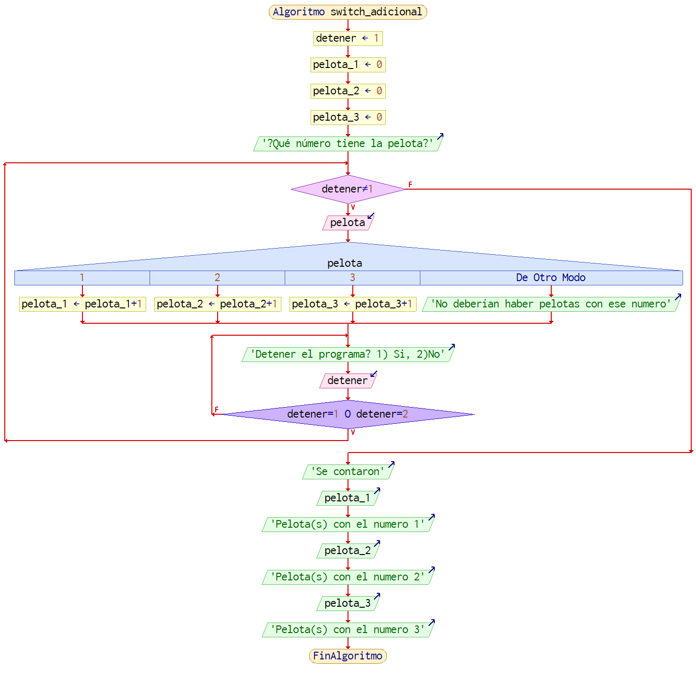
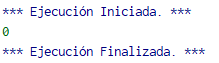
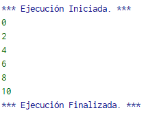
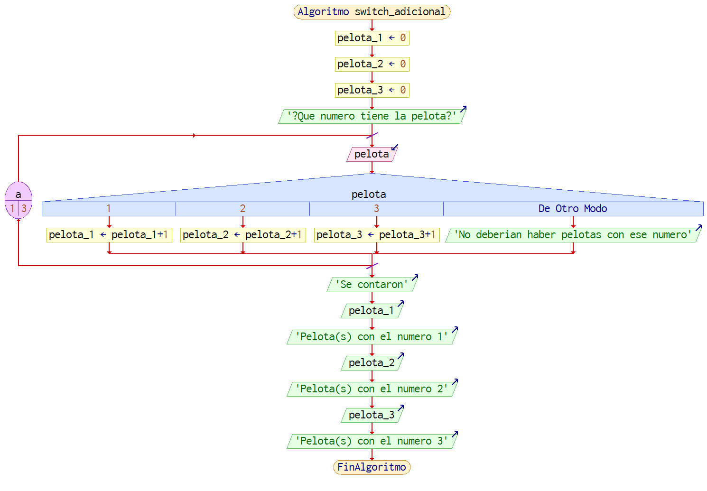

# 1.3.1 Ejemplos Adicionales
Una diferencia entre los tipos de ciclos es el número de iteraciones mínimas. 
Es decir, cuantas veces se ejecuta el bloque interno antes de que la estructura de control pueda detenerlo. 
Es importante reconocer esta característica debido a que puede impactar las situaciones a las que es compatible el ciclo.

En un ciclo while se ve lo siguiente:

iteraciones = 10
Mientras iteraciones < 10 Hacer

Este ciclo nunca entrará si no se cambia el valor de iteraciones para que sea debajo de 10. 
El hecho que el ciclo no ejecute el bloque ni una vez en esta situación da una idea de un uso posible. 
Un ejemplo es un lanzador de pelotas, y este lanzador está conectado a una máquina que automáticamente rellena el contenedor de pelotas. 
Este ciclo revisará si el contenedor está lleno, y si lo está, entonces no hace nada. Evita que se introduzcan pelotas de más.

Mientras tanto, con ciclos ‘do while’ tienen un número de iteraciones mínimo de 1, ya que no se revisa  la condición hasta que se cumple la primera iteración.

```
iteraciones = 10
Repetir
	…
Hasta Que iteraciones <10
```

En este caso, sin importar que se introduzca dentro de este ciclo, por lo menos hará una iteración. 
Este comportamiento todavía tiene un uso: cuando se limpia algo, se va a pasar la toalla por lo menos una vez para secar al final. 
Esto se hace no importa que tan seco se vea lo que se está limpiando


El programa para contar distintas pelotas que se vio en el subtema anterior sólo podría ejecutarse una vez en la forma que se vio en ese entonces. 
Para permitir que ese pedazo de código logre ejecutar cuantas veces se vea necesario, el programa utiliza un ciclo. 
```
Algoritmo switch_adicional
    detener = 1
    pelota_1 = 0
    pelota_2 = 0
    pelota_3 = 0
    Escribir "¿Qué número tiene la pelota?"
    Mientras detener <> 1 Hacer
   	 Leer pelota
   	 Segun pelota Hacer
   		 1:
   			 pelota_1 = pelota_1 + 1
   		 2:
   			 pelota_2 = pelota_2 + 1
   		 3:
   			 pelota_3 = pelota_3 + 1
   		 De Otro Modo:
   			 Escribir "No deberían haber pelotas con ese número"
   	 Fin Segun
   	 
   	 Repetir
   		 Escribir "Detener el programa? 1) Si, 2)No"
   		 Leer detener
   	 Hasta Que detener = 1 O detener = 2 Hacer
   	 
    FinMientras
    
    Escribir "Se contaron"
    Escribir pelota_1
    Escribir "Pelota(s) con el número 1"
    Escribir pelota_2
    Escribir "Pelota(s) con el número 2"
    Escribir pelota_3
    Escribir "Pelota(s) con el número 3"
FinAlgoritmo
```



Imagen 1. Diagrama de flujo del Ejemplo Adicional de ciclos ‘while’ y ‘do-while’.

Mientras no se ingrese un valor que rompa el ciclo principal, el programa seguirá corriendo. 
Aún más, hay un segundo ciclo que evita ingresar un valor no deseado cuando se toma la decisión de salir del programa o no. 
Como el bloque interno debe ejecutarse al menos una vez, se utiliza un ciclo ‘do-while’ que permite una ejecución antes de revisar el valor ingresado.

# 1.4.1 Ejemplos adicionales

En el subtema anterior, se vio el número de iteraciones mínimo para los ciclos while y do-while. Para el ciclo ‘for’, por la implementación en PSeInt, este número es 1.
```
Algoritmo ejemplo_for
    Para a<-0 Hasta 0 Con Paso 1 Hacer
   	 Escribir a
    Fin Para
FinAlgoritmo
```
Ejecutando este código, se ve en la imagen 2 que logra llegar a [Escribir a] una vez antes de salir.



Imagen 2. Ejemplo de salida de un ciclo ‘for’.

El control del número de iteraciones es también distinto con esta implementación del ciclo for. Como la condición de seguir o romper el ciclo depende del valor de 
la variable de control (a en este caso), se puede tomar como un caso de dividir la diferencia entre el valor inicial y final sobre el valor del paso que se da.

Considerando lo anterior, ¿cuántas iteraciones tomaría el siguiente ciclo?
```
Algoritmo ejemplo_for
    Para a<-0 Hasta 10 Con Paso 2 Hacer
   	 Escribir a
    Fin Para
FinAlgoritmo
```


Tomando en cuenta que ejecuta el contenido del ciclo antes de revisar la condición, y ‘paso’ se aplica después de revisar la condición y que se cumple, se espera lo siguiente:

1. Primer ciclo muestra 0
    a. Llegando a la condición, cumpliendo ya que 0 <>10
    b. Suma 0+2 = 2
2. Segundo ciclo muestra 2
    a. Pasa la condición
    b. 2+2 = 4
3. Tercer ciclo muestra 4
    a. Pasa la condición
    b. 4+2=6
4. Cuarto ciclo muestra 6
    a. Pasa la condición
    b. 6+2 = 8
5. Quinto ciclo muestra 8
    a. Pasa la condición
    b. 8+2 = 10
6. Sexto ciclo muestra 10
    a. NO pasa la condición, llegamos al valor final
    b. Sale del ciclo

Y eso es lo que se ve con la salida del programa en la imagen 3.



Imagen 3. Confirmación del comportamiento del ejemplo de ciclo.

Otra diferencia con los tipos de ciclo anteriores es que este tiene un fin predeterminado. Podemos utilizar esta característica en el programa para separar pelotas.

```
Algoritmo switch_adicional
    pelota_1 = 0
    pelota_2 = 0
    pelota_3 = 0
    Escribir "¿Qué número tiene la pelota?"
    Para a<-1 Hasta 3 Con Paso 1 Hacer
   	 Leer pelota
   	 Segun pelota Hacer
   		 1:
   			 pelota_1 = pelota_1 + 1
   		 2:
   			 pelota_2 = pelota_2 + 1
   		 3:
   			 pelota_3 = pelota_3 + 1
   		 De Otro Modo:
   			 Escribir "No deberían haber pelotas con ese número"
   	 Fin Segun
   	 
    Fin Para
    
    Escribir "Se contaron"
    Escribir pelota_1
    Escribir "Pelota(s) con el número 1"
    Escribir pelota_2
    Escribir "Pelota(s) con el número 2"
    Escribir pelota_3
    Escribir "Pelota(s) con el número 3"
FinAlgoritmo
```



Imagen 4. Diagrama de Flujo para ejemplo mejorado de pelotas.

Cambiando el ciclo principal del programa a un ‘for’, movemos del contexto de un número posiblemente infinito de pelotas a un número determinado de estas. 
Cambiando el valor inicial y final de la variable se determina cuántas pelotas serán servidas.

