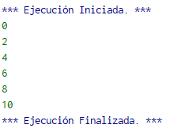

# 1.4.1 Ejemplos adicionales

En el subtema anterior, se vio el número de iteraciones mínimo para los ciclos while y do-while. Para el ciclo ‘for’, por la implementación en PSeInt, este número es 1.
```
Algoritmo ejemplo_for
    Para a<-0 Hasta 0 Con Paso 1 Hacer
   	 Escribir a
    Fin Para
FinAlgoritmo
```
Ejecutando este código, se ve en la imagen 2 que logra llegar a [Escribir a] una vez antes de salir.


Imagen 2. Ejemplo de salida de un ciclo ‘for’.

El control del número de iteraciones es también distinto con esta implementación del ciclo for. Como la condición de seguir o romper el ciclo depende del valor de 
la variable de control (a en este caso), se puede tomar como un caso de dividir la diferencia entre el valor inicial y final sobre el valor del paso que se da.

Considerando lo anterior, ¿cuántas iteraciones tomaría el siguiente ciclo?
```
Algoritmo ejemplo_for
    Para a<-0 Hasta 10 Con Paso 2 Hacer
   	 Escribir a
    Fin Para
FinAlgoritmo
```


Tomando en cuenta que ejecuta el contenido del ciclo antes de revisar la condición, y ‘paso’ se aplica después de revisar la condición y que se cumple, se espera lo siguiente:

1. Primer ciclo muestra 0
    a. Llegando a la condición, cumpliendo ya que 0 <>10
    b. Suma 0+2 = 2
2. Segundo ciclo muestra 2
    a. Pasa la condición
    b. 2+2 = 4
3. Tercer ciclo muestra 4
    a. Pasa la condición
    b. 4+2=6
4. Cuarto ciclo muestra 6
    a. Pasa la condición
    b. 6+2 = 8
5. Quinto ciclo muestra 8
    a. Pasa la condición
    b. 8+2 = 10
6. Sexto ciclo muestra 10
    a. NO pasa la condición, llegamos al valor final
    b. Sale del ciclo

Y eso es lo que se ve con la salida del programa en la imagen 3.



Imagen 3. Confirmación del comportamiento del ejemplo de ciclo.

Otra diferencia con los tipos de ciclo anteriores es que este tiene un fin predeterminado. Podemos utilizar esta característica en el programa para separar pelotas.

```
Algoritmo switch_adicional
    pelota_1 = 0
    pelota_2 = 0
    pelota_3 = 0
    Escribir "¿Qué número tiene la pelota?"
    Para a<-1 Hasta 3 Con Paso 1 Hacer
   	 Leer pelota
   	 Segun pelota Hacer
   		 1:
   			 pelota_1 = pelota_1 + 1
   		 2:
   			 pelota_2 = pelota_2 + 1
   		 3:
   			 pelota_3 = pelota_3 + 1
   		 De Otro Modo:
   			 Escribir "No deberían haber pelotas con ese número"
   	 Fin Segun
   	 
    Fin Para
    
    Escribir "Se contaron"
    Escribir pelota_1
    Escribir "Pelota(s) con el número 1"
    Escribir pelota_2
    Escribir "Pelota(s) con el número 2"
    Escribir pelota_3
    Escribir "Pelota(s) con el número 3"
FinAlgoritmo
```


Imagen 4. Diagrama de Flujo para ejemplo mejorado de pelotas.

Cambiando el ciclo principal del programa a un ‘for’, movemos del contexto de un número posiblemente infinito de pelotas a un número determinado de estas. 
Cambiando el valor inicial y final de la variable se determina cuántas pelotas serán servidas.

