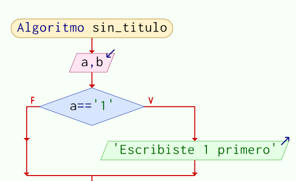
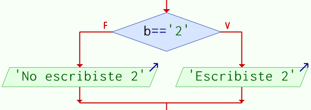
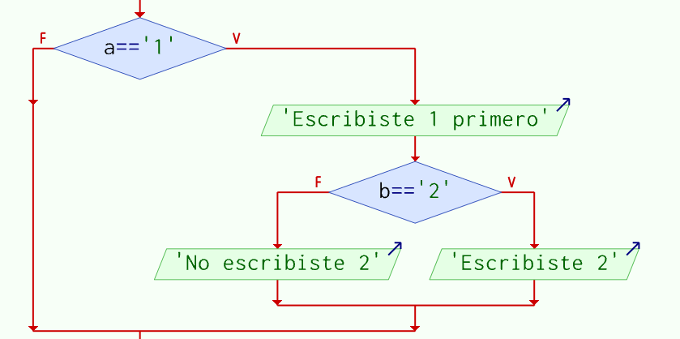
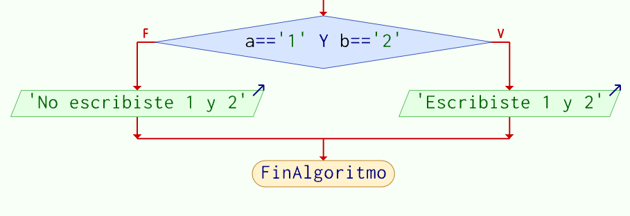
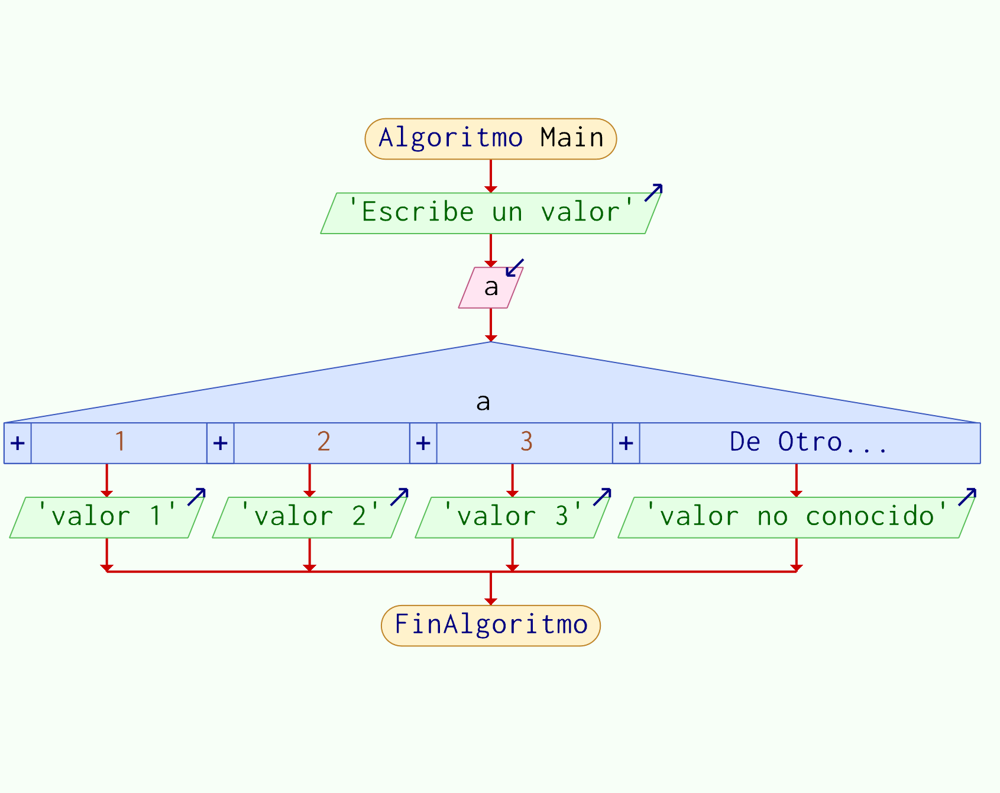
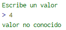
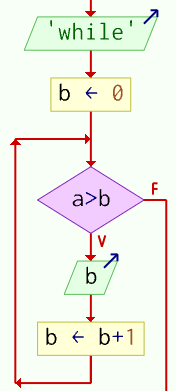
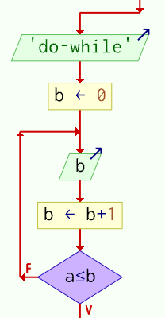
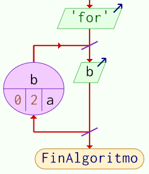
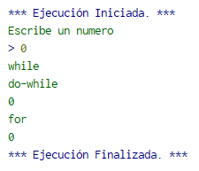

# [Analizar y explicar el comportamiento de las estructuras básicas de control elaborando ejemplos mediante pseudocódigo y diagrama de flujo utilizando la herramienta de PSeInt.](https://www.youtube.com/watch?v=1QasqWossMQ&list=PLx4vAEcrpWyGMKg4tGCZi1QtLeexLZOJy&index=2)

## ‘If’ o ‘Si’
Es una pregunta simple, “¿es la expresión correcta o falsa?” Si la expresión es correcta, ocurre un bloque de código, si no, ocurre otro.

Para el ejemplo tenemos el siguiente algoritmo en la imagen 1:  



Imagen 1. Ejemplo de un caso ‘Si’

Primero se leen dos valores, pasados a las variables ‘a’ y ‘b’, después el programa revisa el valor asignado a ‘a’. 
“Si ‘a’ contiene el valor ‘1’, entonces el programa escribe en la consola ‘Escribiste 1 primero.’”
Ahí se ve que nada ocurre cuando se le asigna un valor a ‘a’ distinto de ‘1’, y se puede acomodar para esa situación. En la imagen 2 se ve el siguiente bloque:  

  

Imagen 2. Ejemplo de caso ‘Si’ con instrucciones en los dos lados.

“Si ‘b’ contiene el valor ‘2’, entonces escribe ‘Escribiste 2’. Pero **si no** contiene el valor ‘2’, entonces escribe ‘No escribiste 2’.
También se puede anidar estas estructuras si se está buscando una combinación específica de valores, como en la imagen 3:

  

Imagen 3. Ejemplo de casos ‘Si’ anidados.

Aqui se revisa si ‘b’ es igual a ‘2’, pero solo hace esa pregunta SI ‘a’ es igual a ‘1’.
Pero no se recomienda hacer eso, al ser una mala práctica en el caso más benigno, hasta ser una causa de mal rendimiento en su forma más maligna. Una mejor forma de hacerlo es agregar
la combinación específica de condiciones dentro de un solo ‘if’, como en la imagen 4.

  

Imagen 4. Ejemplo de utilizar un solo ‘Si’ para varias condiciones.

## Switch case
Cuando una variable puede tener distintos posibles valores, se recomienda el uso del switch case como el que se presenta en la imagen 5.
Aquí se ve que se introduce un valor a la variable ‘a’, y dependiendo al valor asignado, uno de varios mensajes pueden ser proporcionados. 



Imagen 5. Ejemplo de un caso ‘Switch’.

No se está limitado a estas 4 opciones, se pueden agregar más o quitar alguna si se necesita.
Pero si se proporciona un valor fuera del rango esperado, se tiene una contingencia lista:  

  

Imagen 6. Ejemplo del caso ‘de otro modo’.

La imagen 6 demuestra esta contingencia que se conoce como ‘De Otro Modo’ en nuestro código de ejemplo.

Esta se conoce como ‘De Otro Modo’ en nuestro código de ejemplo.
## Ciclos ‘while’, ‘do while’ 
Un ciclo se refiere a un bloque de código que se repite mientras (while) una condición se cumple. Hay 2 tipos de ciclos, cada uno descrito por **cuando se revisa la condición para repetir el bloque.**  

```
Algoritmo Main
	Escribir 'Escribe un numero'
	Leer a
	Escribir 'while'
	b<-0
	Mientras a>b Hacer
		Escribir b
		b <- b+1
	FinMientras
	Escribir 'do-while'
	b<-0
	Repetir
		Escribir b
		b <- b+1
	Hasta Que a<=b
	Escribir 'for'
	Para b<-0 Hasta a Con Paso 2 Hacer
		Escribir b
	FinPara
FinAlgoritmo
```

Primero se tiene ‘while’ en la imagen 7, que primero revisa la condición **antes de ejecutar el bloque.**  

  

Imagen 7. Ciclo 'while'

Aquí primero **revisa si ‘a’ es mayor que b (inicializado en 0)**, si es cierto, aumenta ‘b’ en 1 e imprime el valor de ‘b’. La ejecución regresa al inicio del ciclo, en donde 
está la condición y vuelve a preguntar. Cuando ‘a’ **ya no cumple con la condición**, el ciclo es roto y continua al siguiente bloque. En la imagen 8 se ve otro tipo de ciclo:

  

Imagen 8. Ciclo 'do-while'

Aquí el siguiente aumenta ‘b’ en 1 antes de revisar la condición. Si la condición no se cumple, vuelve a ejecutar la instrucción hasta que la condición se cumpla. 
Esto lo distingue como el ciclo do-while.

## Ciclo 'For'

En el ciclo for, varias cosas son manejadas por el lenguaje que no tienen que ser implementadas por el programador.
```
Para variable_numerica <- valor_inicial Hasta valor_final Con Paso paso Hacer 
	secuencia_de_acciones
Fin Para
```
- `variable_numerica` es la función que utiliza ‘b’ en nuestros ejemplos anteriores como contador.
- Su `valor_inicial`. 
- `valor_final` nos dice en dónde termina nuestro ciclo.
- Moviéndose `paso` valores cada ciclo.

  

Imagen 9. Forma gráfica del ciclo ‘for’.

Aquí en su versión gráfica tenemos ‘b’ como la variable numérica, ‘0’ como valor inicial, ‘2’ como el paso y ‘a’ como el valor final. Regresarnos a los ejemplos del ciclo while y do-while, las instrucciones adicionales que utilizamos para generar un contador ya vienen incluidas en la llamada del ciclo for. En la implementación de PSeInt, funciona como un ciclo do-while, donde se revisa la condición después de ejecutar el bloque interno, demostrado en esta salida del mismo.  



Imagen 10. Ejemplo de salida de distintos tipos de ciclo.