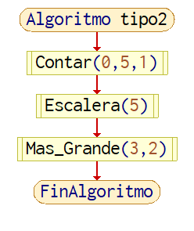
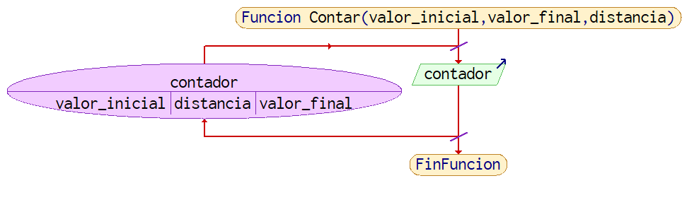
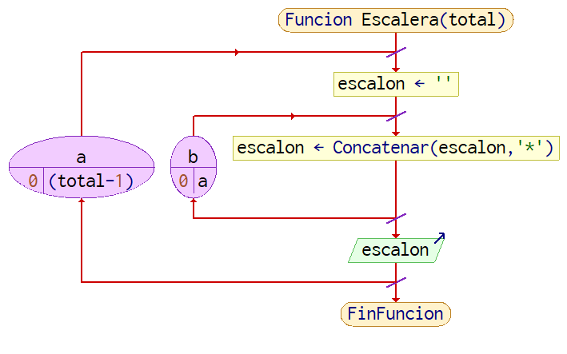
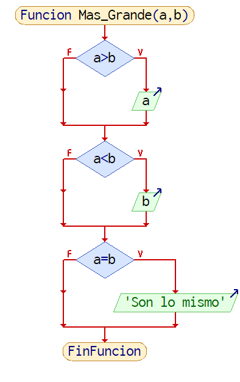

# 2.2.1 Ejemplos adicionales

Estas funciones se utilizarían si se necesita enviar información a un lugar, sin importar si el receptor responde al “mensaje”. Un ejemplo sería una función que va a mostrar la información obtenida al usuario por medio de la pantalla, otro pedazo de hardware o enviándolo a un programa distinto para su muestra.
```
Algoritmo tipo2
    Contar(0,5,1)
    Escalera(5)
    Mas_Grande(3,2)
FinAlgoritmo
```



Imagen 5. Diagrama de flujo del algoritmo ‘tipo2’.

```
Funcion Contar(valor_inicial, valor_final, distancia)
    Para contador<-valor_inicial Hasta valor_final Con Paso distancia Hacer
   	 Escribir contador
    FinPara
FinFuncion
```



Imagen 6. Diagrama de Flujo de la función Contar().

```
0
1
2
3
4
5
```

Lo que se ve en la imagen 6 es un contador simple, se le proporciona el inicio, final y la cantidad de cada iteración. Como el resultado del contador  no utiliza el retorno, esto lo hace una función tipo 2.
```
Funcion Escalera(total)
    Para a<-0 Hasta (total-1) Con Paso 1 Hacer
   	 escalon <- ""
   	 Para b<-0 Hasta a Con Paso 1 Hacer
   		 escalon<-Concatenar(escalon,"*")
   	 FinPara
   	 Escribir escalon
    FinPara
FinFuncion
```



Imagen 7. Diagrama de Flujo de la función Escalera().

```
*
**
***
****
*****
```

Este siguiente ejemplo con la imagen 7 dibuja una escalera por medio de concatenando ‘\*’ en líneas. El primer ciclo controla tanto la impresión de la cadena, como el número de ‘\*’ en ella. 
El segundo ciclo concatena ‘\*’ a una cadena vacía, dictado por el valor de la variable de control en el primer ciclo. 
Una vez más, esta función recibe el parámetro de cuantos escalones quiere el usuario, y no utiliza el retorno en lo absoluto, lo que clasifica a la función como tipo 2

```
Funcion Mas_Grande(a,b)
    Si a>b Entonces
   	 Escribir a
    FinSi
    Si a<b Entonces
   	 Escribir b
    FinSi
    Si a=b Entonces
   	 Escribir "Son lo mismo"
    FinSi
FinFuncion
```



Imagen 8. Diagrama de Flujo de la función Mas_Grande().

La última función en la imagen 8 es más sencilla, utilizando tres ‘if’ para conocer cuál de los dos números proporcionados es más grande, y avisar que son el mismo valor en el caso que se presente. Está recibiendo valores por medio de parámetros, regresa un resultado sin el uso del retorno, es una función de tipo 2.
