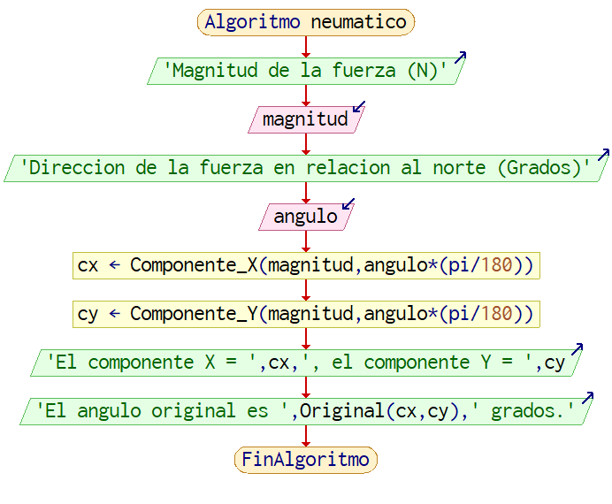
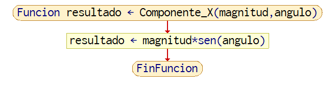
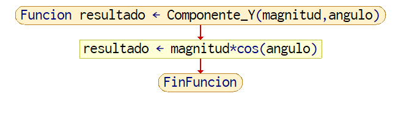
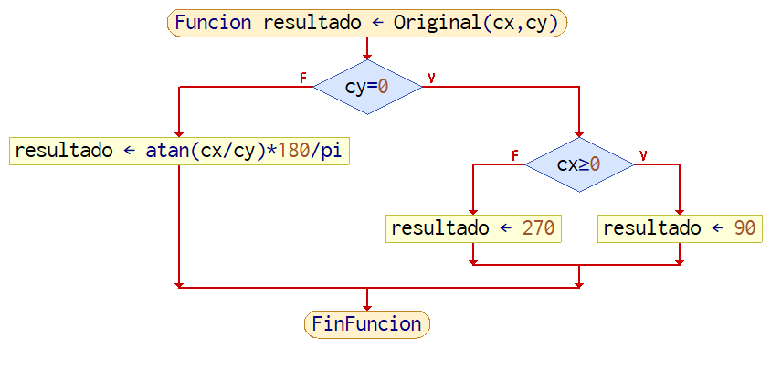
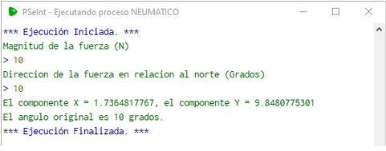

# 2.4.1 Ejemplos adicionales

Digamos que se tiene un neumático. Este neumático puede aplicar fuerza en la dirección a la que está alineada. Un problema al que se llega es que 
para aplicar esa fuerza, se deben conocer los vectores componentes de la misma. 
Conociendo tanto la magnitud, como la dirección de esta fuerza en un plano (x,y), ¿cómo se calculan estos componentes?
```
Algoritmo neumatico
    Escribir 'Magnitud de la fuerza (N)'
    Leer magnitud
    Escribir 'Dirección de la fuerza en relación al norte (Grados)'
    Leer angulo
    cx <- Componente_X(magnitud,angulo*(pi/180))
    cy <- Componente_Y(magnitud,angulo*(pi/180))
    Escribir 'El componente X = ',cx,', el componente Y = ',cy
    Escribir 'El ángulo original es ',Original(cx,cy),' grados.'
FinAlgoritmo

funcion resultado <- Componente_X(magnitud, angulo)
    resultado<-magnitud * sen(angulo)
FinFuncion

funcion resultado <- Componente_Y(magnitud,angulo)
    resultado<-magnitud * cos(angulo)
FinFuncion
```



Imagen 9. Diagrama de Flujo del algoritmo ‘neumático’.

Después de obtener la magnitud y el ángulo, proporcionados por el usuario, los pasamos a nuestras funciones Componente_X y Componente_Y. 
Ambas reciben la magnitud y ángulo transformado a radianes. Utilizando la función de seno para el componente x en la imagen 10.



Imagen 10. Diagrama de Flujo de la función Componente_X().


Y coseno para el componente y en la imagen 11.



Imagen 11. Diagrama de Flujo de la función Componente_Y().

Se obtienen los componentes que se buscan, pero ahí no termina. Digamos que el usuario también quiere que se obtenga un 
ángulo de dos componentes que se presentan. Eso se puede calcular con atan(arcotangente). 
Proporcionando la relación entre el componente x al componente y de la siguiente manera se puede 
obtener el ángulo del cual se calcularon los componentes originalmente.

```
Funcion resultado <- Original(cx,cy)
    Si cy=0 Entonces
   	 Si cx>=0 Entonces
   		 resultado <- 90
   	 SiNo
   		 resultado <- 270
   	 FinSi
    SiNo
   	 resultado <- atan(cx/cy)*180/pi
    FinSi
```



Imagen 12. Diagrama de Flujo de la función Original().

Debido a que se está haciendo una división, hay que prevenir que no se presente un 0 en el divisor, por lo que entran los siguientes ‘if’:
Si el componente y(cy) es 0 y el componente x(cx) es mayor a 0, entonces es 90 grados.
Si el componente y es 0 y el componente x es menor a 0, entonces es 270 grados.


 En el caso que el componente y no es 0, entonces se calcula el ángulo en radianes usando atan(cx/cy), después se convierte en grados, terminando en 
 el resultado final en la imagen 13.



Imagen 13. Ejemplo de resultado del algoritmo ‘neumatico’.

