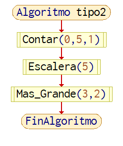
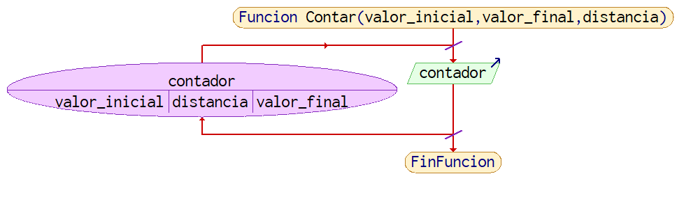
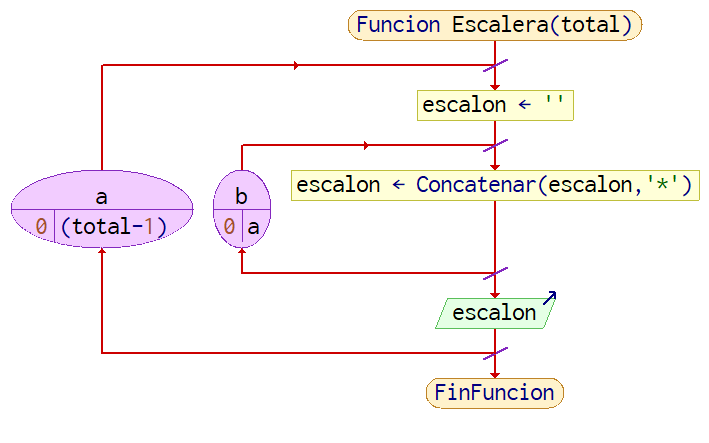
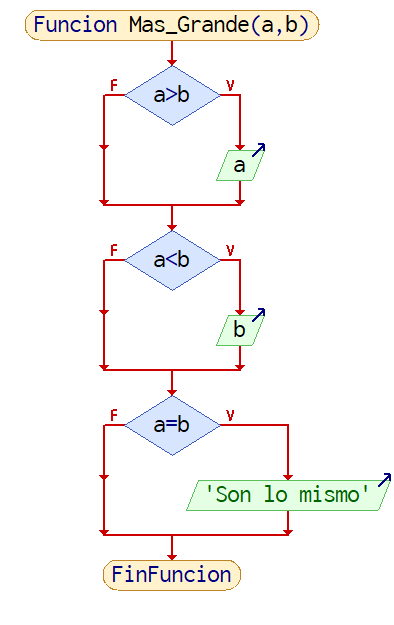
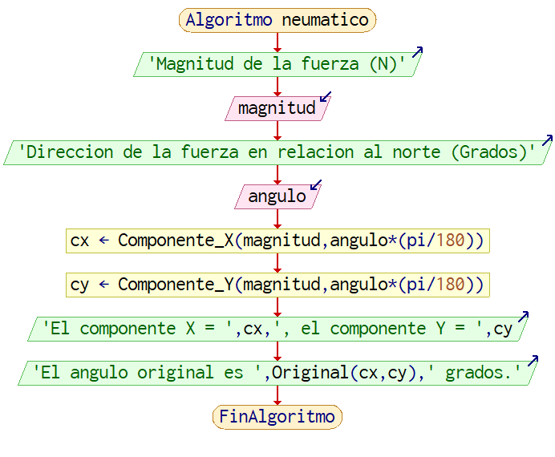
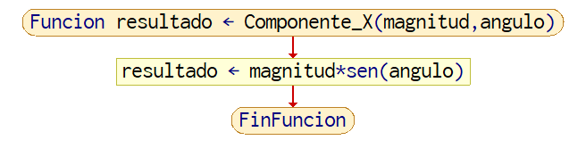
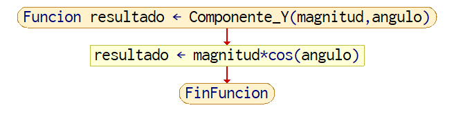
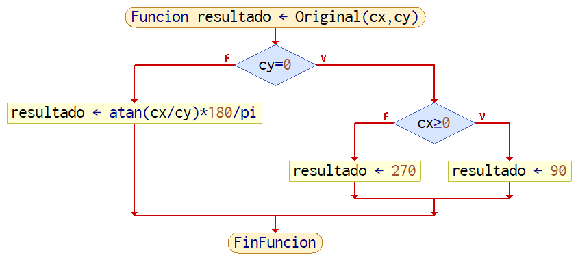
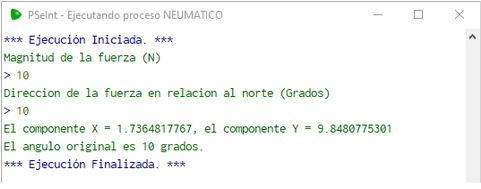

# 2.1.1 Ejemplos adicionales
Cuando se controla hardware simple, como un solo foco/led, es en donde se encontraría este tipo de funciones. Debido a las limitaciones de PSeInt, no existen maneras de controlar hardware, pero para el ejemplo se asume que sí existen. 
```
// Declarando Variables Globales
PIN_LED
PIN_BTN
Algoritmo Ejemplo_Hardware 
    ConfigurarPin()
    Mientras Verdadero Hacer
   	 Si PIN_BTN.presionado
   		 ActivarLED()
   	 SiNo
   		 ApagarLED()
   	 FinSi
    FinMientras
FinAlgoritmo

Funcion ConfigurarPin()
    PIN_LED = nuevo Pin(2,SALIDA)
    PIN_BTN = nuevo Pin(1,ENTRADA)
FinFuncion

Funcion ActivarLED()
    PIN_LED.activado = Verdadero
FinFuncion

Funcion ApagarLED()
    PIN_LED.activado = Falso
FinFuncion
```

.png)

Imagen 1. Diagrama de Flujo del ejemplo adicional 2.1.1.1.

Primero se declaran dos variables globales, PIN_LED y PIN_BTN, las cuales almacenan el estado de la señal transmitida o recibida en la pata asignada del controlador.  El siguiente paso, en la imagen 37, es ConfigurarPin():

.png)

Imagen 2. Diagrama de Flujo de ConfigurarPin(). 

Esta función lo que hace es que toma estas variables globales de PIN_LED y PIN_BTN, y las asigna con el metal de los pines del controlador, permitiéndoles enviar y recibir información respectivamente. Terminando la configuración, pasamos al ciclo principal del programa, manteniendo la ejecución del bloque hasta que el programa sea terminado forzosamente.  Lo primero que se ve dentro del bloque es in ‘if’, el cual revisa la condición del PIN_BTN al leer la señal a través del mismo. En el caso que se detecte una señal que el controlador clasifica como ‘activo’, entonces ejecuta ActivarLED() en la imagen 38.

.png)

Imagen 3. Diagrama de Flujo de ActivarLED().

Lo único que hace es cambiar el estado de PIN_LED a ‘activo’. El controlador manda voltaje por el pin tan pronto esta instrucción se ejecuta. Por el otro lado, en donde no se detecta una señal en PIN_BTN, entonces se ejecuta ApagarLED() en la imagen 39.

.png)

Imagen 4. Diagrama de Flujo de ApagarLED().

Como se ve en este algoritmo, ninguna de las funciones recibe parámetros o utiliza el retorno para complir sus propósitos. Esto las clasifica como funciones de tipo 1.

# 2.2.1 Ejemplos adicionales

Estas funciones se utilizarían si se necesita enviar información a un lugar, sin importar si el receptor responde al “mensaje”. Un ejemplo sería una función que va a mostrar la información obtenida al usuario por medio de la pantalla, otro pedazo de hardware o enviándolo a un programa distinto para su muestra.
```
Algoritmo tipo2
    Contar(0,5,1)
    Escalera(5)
    Mas_Grande(3,2)
FinAlgoritmo
```



Imagen 5. Diagrama de flujo del algoritmo ‘tipo2’.

```
Funcion Contar(valor_inicial, valor_final, distancia)
    Para contador<-valor_inicial Hasta valor_final Con Paso distancia Hacer
   	 Escribir contador
    FinPara
FinFuncion
```



Imagen 6. Diagrama de Flujo de la función Contar().

```
0
1
2
3
4
5
```

Lo que se ve en la imagen 6 es un contador simple, se le proporciona el inicio, final y la cantidad de cada iteración. Como el resultado del contador  no utiliza el retorno, esto lo hace una función tipo 2.
```
Funcion Escalera(total)
    Para a<-0 Hasta (total-1) Con Paso 1 Hacer
   	 escalon <- ""
   	 Para b<-0 Hasta a Con Paso 1 Hacer
   		 escalon<-Concatenar(escalon,"*")
   	 FinPara
   	 Escribir escalon
    FinPara
FinFuncion
```



Imagen 7. Diagrama de Flujo de la función Escalera().

```
*
**
***
****
*****
```

Este siguiente ejemplo con la imagen 7 dibuja una escalera por medio de concatenando ‘\*’ en líneas. El primer ciclo controla tanto la impresión de la cadena, como el número de ‘\*’ en ella. 
El segundo ciclo concatena ‘\*’ a una cadena vacía, dictado por el valor de la variable de control en el primer ciclo. 
Una vez más, esta función recibe el parámetro de cuantos escalones quiere el usuario, y no utiliza el retorno en lo absoluto, lo que clasifica a la función como tipo 2

```
Funcion Mas_Grande(a,b)
    Si a>b Entonces
   	 Escribir a
    FinSi
    Si a<b Entonces
   	 Escribir b
    FinSi
    Si a=b Entonces
   	 Escribir "Son lo mismo"
    FinSi
FinFuncion
```



Imagen 8. Diagrama de Flujo de la función Mas_Grande().

La última función en la imagen 8 es más sencilla, utilizando tres ‘if’ para conocer cuál de los dos números proporcionados es más grande, y avisar que son el mismo valor en el caso que se presente. Está recibiendo valores por medio de parámetros, regresa un resultado sin el uso del retorno, es una función de tipo 2.

# 2.3.1 Ejemplos adicionales
Un reloj necesita solicitar el segundo UNIX para mostrar la fecha y hora exactas, y obtiene esa información con una función de este tipo. 
```
Funcion regreso <- Fecha()
    regreso <- "12:01:23 12 abril 2023"
FinFuncion
```
Para obtener información de hardware, como un sensor, esa es una manera de hacerlo.

```
Funcion regreso <-Temperatura()
    regreso<- "25 c"
FinFuncion
```
También se pueden utilizar para mantener supervisión de cierta información dentro del programa o sistema.

```
Funcion regreso<-Estado()
    Si Temperatura() > 50 Entonces
   	 regreso<- "Sobrecalentamiento"
    FinSi
    Si Fecha() > "12 Octubre 2023"
   	 regreso <- "Atrasado"
    FinSi
FinFuncion
```

Por último, una razón para mantener un retorno en la mayoría de las funciones. Aunque la función en si no este regresando información 
para su uso en otra parte del programa, vale la pena agregar que regrese “verdadero” en los casos que la función cumplio su propósito sin problemas.

# 2.4.1 Ejemplos adicionales

Digamos que se tiene un neumático. Este neumático puede aplicar fuerza en la dirección a la que está alineada. Un problema al que se llega es que 
para aplicar esa fuerza, se deben conocer los vectores componentes de la misma. 
Conociendo tanto la magnitud, como la dirección de esta fuerza en un plano (x,y), ¿cómo se calculan estos componentes?
```
Algoritmo neumatico
    Escribir 'Magnitud de la fuerza (N)'
    Leer magnitud
    Escribir 'Dirección de la fuerza en relación al norte (Grados)'
    Leer angulo
    cx <- Componente_X(magnitud,angulo*(pi/180))
    cy <- Componente_Y(magnitud,angulo*(pi/180))
    Escribir 'El componente X = ',cx,', el componente Y = ',cy
    Escribir 'El ángulo original es ',Original(cx,cy),' grados.'
FinAlgoritmo

funcion resultado <- Componente_X(magnitud, angulo)
    resultado<-magnitud * sen(angulo)
FinFuncion

funcion resultado <- Componente_Y(magnitud,angulo)
    resultado<-magnitud * cos(angulo)
FinFuncion
```



Imagen 9. Diagrama de Flujo del algoritmo ‘neumático’.

Después de obtener la magnitud y el ángulo, proporcionados por el usuario, los pasamos a nuestras funciones Componente_X y Componente_Y. 
Ambas reciben la magnitud y ángulo transformado a radianes. Utilizando la función de seno para el componente x en la imagen 10.



Imagen 10. Diagrama de Flujo de la función Componente_X().


Y coseno para el componente y en la imagen 11.



Imagen 11. Diagrama de Flujo de la función Componente_Y().

Se obtienen los componentes que se buscan, pero ahí no termina. Digamos que el usuario también quiere que se obtenga un 
ángulo de dos componentes que se presentan. Eso se puede calcular con atan(arcotangente). 
Proporcionando la relación entre el componente x al componente y de la siguiente manera se puede 
obtener el ángulo del cual se calcularon los componentes originalmente.

```
Funcion resultado <- Original(cx,cy)
    Si cy=0 Entonces
   	 Si cx>=0 Entonces
   		 resultado <- 90
   	 SiNo
   		 resultado <- 270
   	 FinSi
    SiNo
   	 resultado <- atan(cx/cy)*180/pi
    FinSi
```



Imagen 12. Diagrama de Flujo de la función Original().

Debido a que se está haciendo una división, hay que prevenir que no se presente un 0 en el divisor, por lo que entran los siguientes ‘if’:
Si el componente y(cy) es 0 y el componente x(cx) es mayor a 0, entonces es 90 grados.
Si el componente y es 0 y el componente x es menor a 0, entonces es 270 grados.


 En el caso que el componente y no es 0, entonces se calcula el ángulo en radianes usando atan(cx/cy), después se convierte en grados, terminando en 
 el resultado final en la imagen 13.



Imagen 13. Ejemplo de resultado del algoritmo ‘neumatico’.

