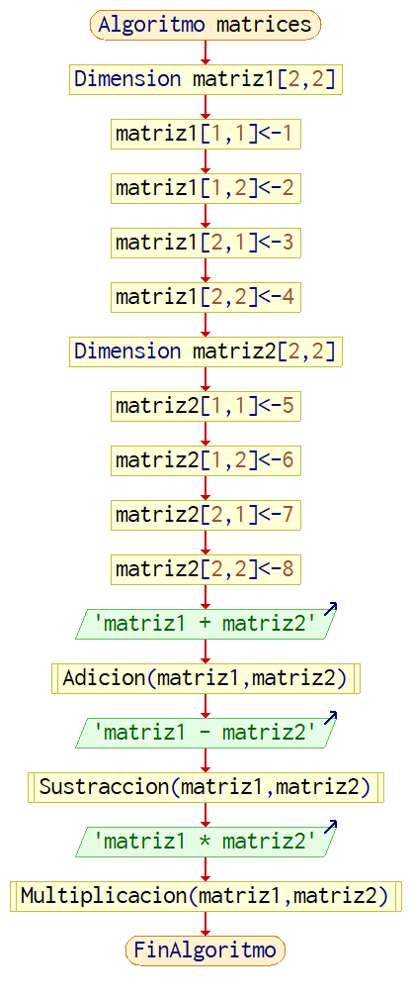
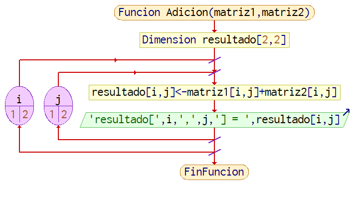
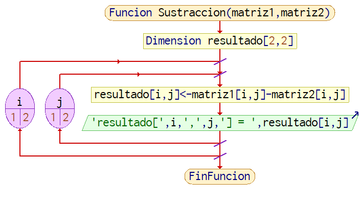
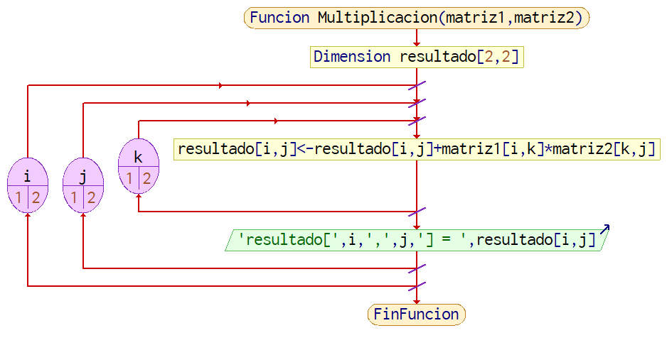
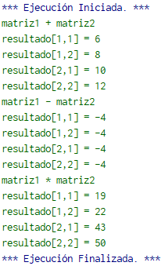

# 3.1.1 Ejemplos adicionales
Un uso importante de los arreglos es la representación de matrices, componente importante de la álgebra lineal. 
Y como las matrices, se puede aplicar sus operaciones sobre los arreglos. Las operaciones que se verán son adición, sustracción, multiplicación.
```
Algoritmo matrices
    //Se declaran las matrices
    dimension matriz1[2,2]
    matriz1[1,1] = 1 //1,2
    matriz1[1,2] = 2 //3,4
    matriz1[2,1] = 3
    matriz1[2,2] = 4

    dimension matriz2[2,2]
    matriz2[1,1] = 5 //5,6
    matriz2[1,2] = 6 //7,8
    matriz2[2,1] = 7
    matriz2[2,2] = 8
    
//Aquí ocurren las operaciones
    Escribir 'matriz1 + matriz2'
    Adicion(matriz1, matriz2)
    Escribir 'matriz1 - matriz2'
    Sustracion(matriz1, matriz2)
    Escribir 'matriz1 * matriz2'
    Multiplicacion(matriz1, matriz2)
FinAlgoritmo
```



Imagen 1. Diagrama de flujo del algoritmo matrices.

El propósito del algoritmo en la imagen 1 es preparar las matrices para las operaciones a las que se someten en las funciones. Tenemos dos matrices:

| 1 | 2 |
|---|---|
| 3 | 4 |

y 

|6|5|
|-|-|
|8|7|  

Sobre las cuales haremos Adición en la imagen 2, Sustracción en la imagen 3 y Multiplicación en la imagen 4. 

```
Funcion Adicion(matriz1, matriz2)
    Dimension resultado[2,2]
    Para i<-1 Hasta 2 Con Paso 1 Hacer
   	 Para j<-1 Hasta 2 Con Paso 1 Hacer
   		 resultado[i,j] <- matriz1[i,j] + matriz2[i,j]
   		 Escribir 'resultado[',i,',',j,'] = ',resultado[i,j]
   	 Fin Para
    Fin Para
    
FinFuncion
```



Imagen 2. Diagrama de flujo de Adición().

```
Funcion Sustracion(matriz1, matriz2)
    Dimension resultado[2,2]
    Para i<-1 Hasta 2 Con Paso 1 Hacer
   	 Para j<-1 Hasta 2 Con Paso 1 Hacer
   		 resultado[i,j] <- matriz1[i,j] - matriz2[i,j]
   		 Escribir 'resultado[',i,',',j,'] = ',resultado[i,j]
   	 Fin Para
    Fin Para
FinFuncion
```



Imagen 3. Diagrama de flujo de Sustraccion()

```
Funcion Multiplicacion(matriz1, matriz2)
    Dimension resultado[2,2]
    Para i<-1 Hasta 2 Con Paso 1 Hacer
   	 Para j<-1 Hasta 2 Con Paso 1 Hacer
   		 Para k<-1 Hasta 2 Con Paso 1 Hacer
   			 resultado[i,j] <- resultado[i,j] + matriz1[i,k]* matriz2[k,j]
   		 Fin Para
   		 Escribir 'resultado[',i,',',j,'] = ',resultado[i,j]
   	 Fin Para
    Fin Para
FinFuncion
```



Imagen 4. Diagrama de flujo de la función Multiplicacion()

Con los resultados que se ven en la imagen 5, vemos que adición y sustracción son hacer suma y resta sobre los valores de la misma casilla, para cada casilla en las matrices y la multiplicación es la sumatoria de los productos termino a termino de la fila de la matriz 1 y de la columna de la matriz 2 que intersectan la casilla resultante. (Berrío & Guillermo, 2021)



Imagen 5. Resultados del algoritmo matrices
