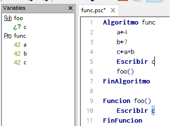
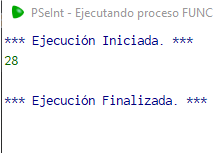
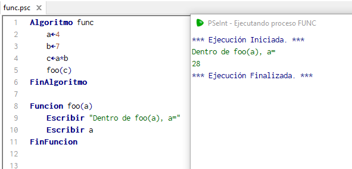
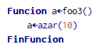
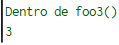
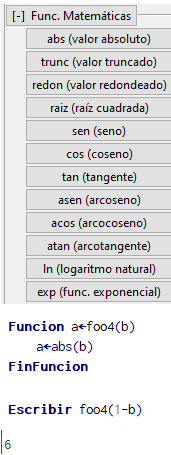

# [3. Explicar los tipos de función y su aplicación elaborando ejemplos mediante pseudocódigo y diagrama de flujo utilizando la herramienta de PSeInt.](https://www.youtube.com/watch?v=eE24YdAjF7c&list=PLx4vAEcrpWyGMKg4tGCZi1QtLeexLZOJy&index=3)

Una función es una sección de código separada del bloque principal para ser llamada después o múltiples veces sin tener que volver a escribir ese pedazo de código. 
Las funciones pueden, pero no están forzadas, a recibir información (parámetros) y regresar información de regreso (retorno). De acuerdo a cuales de estas dos utiliza, se clasifican las funciones. 
## Tipo 1
Las funciones de tipo 1 no reciben parámetros, ni regresan un retorno.
Un ejemplo de estos es una función de inicialización, donde se ejecuta esta función al iniciar el programa. Esta función sólo tendrá acceso a variables que están dentro de su alcance sin el uso de parámetros. En el caso de PSeInt, una función de este tipo solo se le puede asignar información antes de ejecución y no se podrá traspasar información adicional empezando la ejecución.  
  
Como se ve aquí, la función foo() no tiene idea del valor de c declarado en func, solo una segunda instancia que solo existe en el alcance de foo(). Ejecutando el programa solo muestra lo siguiente.  
  
## Tipo 2
Funciones que sí reciben parámetros, pero no tienen información de retorno.  

El regresar información no requiere del retorno, puede ser imprimir esa información en la pantalla en forma de texto o una gráfica. En este caso, la función “Escribir” es una función de este tipo.  
  
## Tipo 3
Funciones que no reciben parámetros, pero si tienen información de retorno.

Una función de este tipo que es usada habitualmente es la de rand(), o en este caso azar(). Como dice el nombre de la función, regresa un número aleatorio dentro del rango dado. Dependerá de la implementación si la función requiere un parámetro o tiene un rango predefinido, pero en este caso podemos forzarla dentro del rango 0-10 de la siguiente manera.  
  

## Tipo 4
Funciones que tanto reciben parámetros y regresan información por retorno.

Este sería el tipo más común de encontrar, en mi opinión, y también el más fácil de encontrar una situación para aplicarlo. Asi es como funcionan todas las funciones matematicas.
