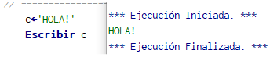

# [Explicar las estructuras básicas de datos, tales como arreglos y cadenas; utilizando la herramienta de PSeInt.](https://www.youtube.com/watch?v=cJ_BDXCIdkw&list=PLx4vAEcrpWyGMKg4tGCZi1QtLeexLZOJy&index=4)
## Arreglos
Un arreglo es un grupo de valores organizados con la manera de acceder a cualquiera de estos en cualquier momento. En PSeInt los arreglos se declaran con “Dimensión” de la siguiente manera:  

`Dimension a[]`  

Donde ‘a’ es el nombre; ‘b’ siendo el tamaño del arreglo. El uso de arreglos es para almacenar múltiples valores relacionados bajo un mismo lugar, sin tener que declarar múltiples variables al mismo tiempo.  

```
Dimension a[5] //Esto hace una funcion similar a
//	a1<-'H' //Todo
//	a2<-'O'
//	a3<-'L'
//	a4<-'A'
//	a5<-'!' //esto, pero mas bonito
```

El utilizar un arreglo es como cualquier otra variable, pero se tiene que especificar la posición.  

```
a[1]<-'H' //asi se asigna
Escribir a[1] //asi se accede
```

El primer ejemplo de uso de un arreglo es representar conjuntos de caracteres, palabras u oraciones, como se ve en la imagen 1.  


Imagen 1. Usando un arreglo para almacenar caracteres.

## Cadenas

Recientemente, esta funcionalidad de almacenar carácteres ha sido pasada al tipo de dato ‘String’, presentado en la imagen 2. Este tipo de dato es utilizado para el almacenamiento de cadenas de caracteres.

  

Imagen 2. Uso de una cadena.

Estos tienen funciones especiales, como separar, juntar o modificar las cadenas, vistas en la imagen 3.  

  

Imagen 3. Funciones para cadenas.


Para definir las funciones de cadenas:
- Longitud(cadena) //Obtenemos cuantos caracteres existen dentro de esta cadena.
- SubCadena(cadena,desde,hasta)//Obtenemos una copia de una sección de la cadena, especificando cuándo empieza y termina.
- Concatenar(cadena,cadena) //Unimos dos cadenas, resultando una tercera nueva con el resultado.
- ConvertirANumero(cadena) //Nos permite utilizar un número obtenido de una cadena en un cálculo.
- ConvertirATexto(número) //Nos permite usar el resultado de un cálculo matemático en funciones de cadenas.
- Mayusculas(cadena) //Convierte toda la cadena a Mayúsculas.
- Minusculas(cadena) //Convierte toda la cadena a Minúsculas.


Pero regresando a los arreglos, no estamos limitados a solo arreglos ‘lineales’ de una sola  dimensión (longitud), podemos hacer de 2 dimensiones.  

```
Dimension b[2,2] //Dimension cuadrada(dos ejes)
	b[1,1]<-1
	b[1,2]<-2// Esto es una matriz de 2*2 de la forma
	b[2,1]<-3//[1,2]
	b[2,2]<-4//[3,4]
```

También se pueden crear de 3, 4, 5 o más dimensiones; pero no hay razón de preocuparse con eso a menos que sea algo que se necesite.