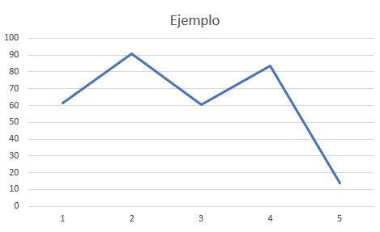
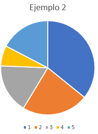
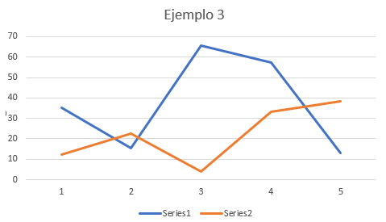

# 3.1.1 Ejemplos adicionales
¿Que se puede representar en un arreglo? Aparte de las cadenas de caracteres, se pueden representar gráficas:
¿Un valor a lo largo del tiempo de la imagen 1? Fácil.



Imagen 1. Gráfica lineal para representar en un arreglo.

La gráfica en la imagen 66 se puede representar como:

```
Dimension a[5]
a[1]<- 61.37074036
a[2]<- 90.6198851
a[3]<- 60.32321702
a[4]<- 83.37565266
a[5]<- 13.93600474
```

¿Una gráfica de pastel, como la de la imagen 2? No es complicado.



Imagen 2. Gráfica de Pastel a representar.

```
Dimension b[5]
b[1]<- 37.97680347
b[2]<- 24.21731484
b[3]<- 18.0377767
b[4]<- 7.417384594
b[5]<- 18.39753251
```

¿Representa múltiples variables a lo largo del tiempo como la imagen 3? ¡Todavía se puede!



Imagen 3. Gráfica con múltiples variables.

```
Dimension c[5,5]
c[1,1]<-35.36387268
c[1,2]<-15.2604749
c[1,3]<-65.61275955
c[1,4]<-57.34721861
c[1,5]<-13.23886156

c[2,1]<-12.25836424
c[2,2]<-22.52231932
c[2,3]<-3.866261797
c[2,4]<-33.11737177
c[2,5]<-38.40763227
```

# 3.2.1 Ejemplos adicionales
Obteniendo subcadenas nos permite hacer ediciones sobre la cadena original. Empezando con la cadena “Hay 3 peces en la pecera” podemos:
- Agregar
	```
	inicio <- "Hay 3 peces en la pecera"
	Escribir inicio
	Escribir Concatenar(inicio," azul")
	```
	
	```
	Hay 3 peces en la pecera
	Hay 3 peces en la pecera azul
	```


	Concatenar une las dos cadenas que se le proporciona en los argumentos, cuales son la cadena ‘inicio’ y la cadena literal “ azul”. El resultado es que se agrega la cadena “ azul” a la cadena ‘inicio’.

- Remover		
	```
	inicio <- "Hay 3 peces en la pecera"
	a<- SubCadena(inicio,1,4)
	Escribir a
	b<- Subcadena(inicio,7,24)
	Escribir b
	Escribir Concatenar(a,b)
	```

	```
	Hay
	Peces en la pecera
	Hay peces en la pecera
	```

	La función Subcadena recibe tres parámetros, la cadena original, la posición inicial a cortar y el número de caracteres desde esa posición inicial que se toman en la subcadena. 
	Por medio de subcadena se separa el texto alrededor del número ‘3’, el objetivo a  remover, después se concatenan las dos piezas de regreso.
	Con esto, el resultado es una cadena sin la sección que se buscaba remover, demostrado en la imagen 73.
	
- Reemplazar	
	```
	inicio <- "Hay 3 peces en la pecera"
	a<- SubCadena(inicio,1,4)
	Escribir a
	b<- Subcadena(inicio,7,24)
	Escribir b
	Escribir Concatenar(a,b)
	c<-Concatenar(a,"4")
	Escribir c
	final<- Concatenar(c,b)
	Escribir final
	```

	```
	Hay
	Peces en la pecera
	Hay peces en la pecera
	Hay 4
	Hay 4 peces en la pecera
	```

	Removiendo el ‘3’ en el ejemplo anterior nos da la oportunidad de agregar algo distinto entre las dos partes al concatenar un ‘4’ a la primera parte antes de unirlas, como se ve en la imagen 74.

