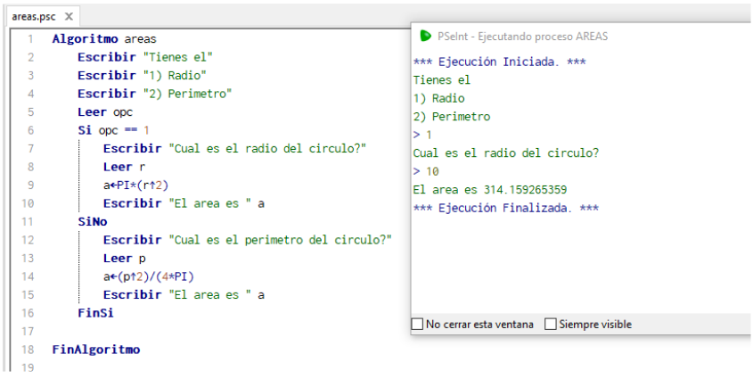

# [5. Resolver problemas concretos siguiendo una secuencia de instrucciones, mediante la herramienta de PSeInt.](https://www.youtube.com/watch?v=0X-Yj8ugpuM&list=PLx4vAEcrpWyGMKg4tGCZi1QtLeexLZOJy&index=5)
La programación en su forma más básica es darle instrucciones a un dispositivo. Instrucciones para obtener información de su ambiente, sea interno o externo; instrucciones para procesar esa información obtenida, y por último instrucciones para regresar el resultado de sus cálculos. Separando problemas complejos en problemas sencillos que entren en una de estas tres categorías es la mentalidad que se necesita.

Aquí vamos a aplicar esta mentalidad para desarrollar algoritmos para obtener el área de distintas figuras, y que todos trabajen dentro del mismo programa. En este ejemplo se consideran regulares en el caso de polígonos superiores a las 4 lados.

Empezando con 0 “lados”, tenemos al círculo. La fórmula para calcular el área es  
$a= \pi r^2$  
Donde $a$ es el área que se busca, $\pi$ es la constante pi y $r$ es el radio del círculo, subido a la segunda potencia. Entonces lo subdividimos en:

- Recibiendo el radio del círculo.
- Calculando el radio al cuadrado y multiplicar ese resultado por la constante 
- Regresando el área calculada hacia el usuario.

En PSeInt se vería de la manera representada en la imagen 1:  

```
Escribir "Cual es el radio del circulo?"
Leer r
a<-PI*(r^2)
Escribir "El area es " a
```

  

Imagen 1 Algoritmo áreas y un resultado de ejemplo.

Pero hay situaciones donde no se conoce el radio, si no solo el perímetro del círculo. ¿Qué se haría en esa situación? Conociendo que $p = \pi d$, $p$ siendo el perimetro del circulo y $d$ el diámetro del 
círculo, que en sí es $d = 2r$. Con esto resolvemos para $r = p2$  y después para $a = \pi (\frac{p}{2 \pi})^2 -> a= \frac{p^2}{4 \pi}$.
Pero ahora tenemos dos maneras de calcular el área, con información distinta para cada una. Si queremos tener ambas dentro del mismo programa, hay que separar como llamarlas.

Pero el programa necesita conocer cuál manera se va a utilizar. Como solo son dos opciones, podemos con un simple IF de acuerdo con lo que se introdujo en opc en la imagen 2.

```
Algoritmo areas
	Escribir "Tienes el"
	Escribir "1) Radio"
	Escribir "2) Perimetro"
	Leer opc
	Si opc == 1
		Escribir "Cual es el radio del circulo?"
		Leer r
		a<-PI*(r^2)
		Escribir "El area es " a
	SiNo
		Escribir "Cual es el perimetro del circulo?"
		Leer p
		a<-(p^2)/(4*PI)
		Escribir "El area es " a
	FinSi
FinAlgoritmo
```

  

Imagen 2. Agregando el ‘Si’ al ejemplo.

De una vez, mientras estamos agregando mejoras a la experiencia de usuario, encapsulamos el programa dentro de una ciclo en la imagen 3 para no tener que reabrir el programa cada vez que se necesita.

```
Algoritmo areas
	Repetir
		Escribir "Tienes el"
		Escribir "1) Radio"
		Escribir "2) Perimetro"
		Leer opc
		Si opc == 1
			Escribir "Cual es el radio del circulo?"
			Leer r
			a<-PI*(r^2)
			Escribir "El area es " a
		SiNo
			Escribir "Cual es el perimetro del circulo?"
			Leer p
			a<-(p^2)/(4*PI)
			Escribir "El area es " a
		FinSi
	Hasta Que Falso
FinAlgoritmo
```

  

Imagen 3. Agregando el ciclo al ejemplo.

Necesitamos una forma de detener el ciclo y salir del programa, afortunadamente ya tenemos una variable que ya utilizamos para tomar decisiones (opc).

```
Algoritmo areas
	Repetir
		Escribir "Tienes el"
		Escribir "1) Radio"
		Escribir "2) Perimetro"
		Escribir "3) Salir del programa"
		Leer opc
		Si opc == 1
			Escribir "Cual es el radio del circulo?"
			Leer r
			a<-PI*(r^2)
			Escribir "El area es " a
		SiNo
			Escribir "Cual es el perimetro del circulo?"
			Leer p
			a<-(p^2)/(4*PI)
			Escribir "El area es " a
		FinSi
	Hasta Que opc = 3
FinAlgoritmo
```


Imagen 4. Diagrama de flujo del algoritmo completo.
  
Aquí introducir ‘3’ hace que termine el programa. Con esto el flujo del programa está terminado, pero nos faltan opciones. 
Se mencionó inicialmente que se podría calcular el área de varias figuras con el programa, pero al momento solo tenemos dos maneras de calcular la de un círculo. 
Para hacer más fácil de leer el código, se separa lo que ya se tiene en funciones.

```
Funcion CirRadi()
	Escribir "Cual es el radio del circulo?"
	Leer r
	a<-PI*(r^2)
	Escribir "El area es " a
FinFuncion
Funcion  CirPeri()
	Escribir "Cual es el perimetro del circulo?"
	Leer p
	a<-(p^2)/(4*PI)
	Escribir "El area es " a
FinFuncion
```

Hacemos una nueva función por cada figura/método que agreguemos. Después es el caso de la selección como tal. Como se dijo anteriormente, el uso de muchos IFs seguidos o anidados no se ve bien, así que lo ponemos en un switch-case.

```
Segun opc Hacer
		1:
			CirRadi()
		2:
			CirPeri()
		3:
			secuencia_de_acciones_3
	Fin Segun
```

Con esto el ejemplo termina, pero uno puede agregar las opciones que quiera.
